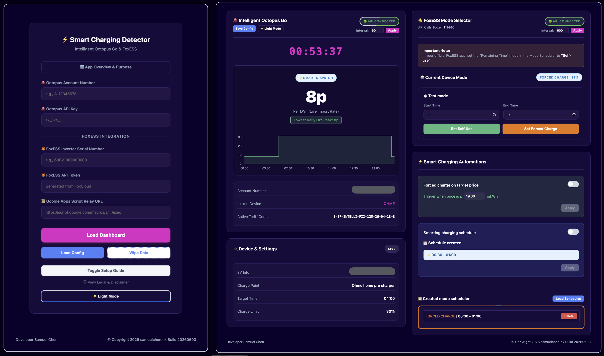

# Octopus & FoxESS Smart Charging Detector

A lightweight, zero-install smart automation bridge to prevent FoxESS home batteries from draining during Intelligent Octopus Go EV charging slots.

## ℹ️ The Problem & The Solution
When *Intelligent Octopus Go* dynamically opens a cheap slot to charge your electric vehicle, your FoxESS solar battery thinks your home is experiencing a massive energy load[cite: 3]. If your inverter is left in standard "Self-Use" mode, it will aggressively dump all your stored home battery power straight into your EV[cite: 3]. This wastes your captured solar energy, degrades your battery cells, and misses the opportunity to soak up cheap off-peak rates[cite: 3].

This standalone web tool acts as a private automation bridge. It pulls upcoming smart dispatch intervals via your Octopus account and syncs them directly with your FoxESS inverter using the robust V3 Mode Scheduler API[cite: 3]. Your system automatically locks into **Force Charge** exactly when the car starts drinking cheap grid power, completely insulating your home battery[cite: 3].

---

## 🔑 Credentials Guide: Where to Find Your API Info

Before launching the app, you will need to gather 4 specific pieces of information:

### 1. 🐙 Octopus Energy Credentials
* **Account Number:** Log into your standard Octopus Energy dashboard. Your account number is at the top of the page and usually starts with `A-XXXXXXXX`[cite: 3].
* **API Key:** Go to your account profile page, click on **Personal Details**, and scroll down to **API Access** (or go directly to `octopus.energy/dashboard/new/accounts/personal-details/api-access`)[cite: 3]. Click generate to get your secret key starting with `sk_live_...`[cite: 3].

### 2. 🦊 FoxESS Cloud Credentials
* **Inverter Serial Number (SN):** You can find this on a physical sticker on the side of your inverter, or open your **FoxCloud Mobile App**, tap **Device**, and look directly below the inverter image[cite: 3]. It typically starts with a code like `60B...`[cite: 3].
* **API Token:** You *cannot* generate this from the mobile app. You must log into the official **FoxCloud V1 Web Dashboard** at `www.foxesscloud.com/login`[cite: 3]. Once logged in, go to **User Profile** ➔ **API Management** to generate and copy your API Token[cite: 3].

---

## 🚀 Detailed Setup Guide

### 1. Download & Run the Local File
Because this application runs entirely client-side for absolute privacy:
1. Click on `Octoups_IGO_Smart_Charing_Detector.html` in this repository[cite: 3].
2. Click the **Download raw file** button in the top right of the file view to save it locally.
3. Simply double-click the file to open the dashboard interface natively inside any modern web browser.

### 2. Deploy Your Google Apps Script Proxy (Required)
FoxESS cloud servers enforce strict browser security protocols (CORS restrictions) which explicitly block standalone web pages from sending direct network requests[cite: 3]. 

To easily bypass this without configuring an expensive server, we use a short, private Google Apps Script relay. 

1. Launch the downloaded app file in your browser.
2. Click the red **"View Setup Instructions"** button inside the setup guide panel[cite: 3].
3. Follow the steps displayed to copy your private routing script and deploy it as a web app[cite: 3].
4. Paste your generated Google Web App URL into the app login screen along with your cloud credentials[cite: 3].

---

## 🔒 Security, Privacy & Local Storage
Your security is maintained by design:
* **Zero Third-Party Logging:** This application does not run on an external web server and does not transmit data to any tracking networks. All logic occurs in your personal browser tab.
* **Local Encryption:** Your credentials can be saved locally within your browser's standard `localStorage` wrapper[cite: 3]. For safe manual backups, you can download a locally encrypted backup data file protected by AES-256 standard encryption[cite: 3].

---

## ⚖️ Legal Disclaimer
This software is an unofficial, community-driven utility[cite: 3]. It is entirely independent and has no official affiliation, endorsement, or operational relationship with Octopus Energy Ltd or FoxESS Co., Ltd[cite: 3]. Product names, trademarks, and branding belong exclusively to their respective corporate holders[cite: 3]. 

Controlling physical battery infrastructure and working with third-party web services introduces natural hardware degradation and rate-limiting risks[cite: 3]. By executing this script, you accept full individual liability for system stability, unexpected inverter behaviors, or billing discrepancies[cite: 3]. Monitor system logs consistently[cite: 3].

Licensed globally under the **GNU General Public License v3.0**[cite: 3].
