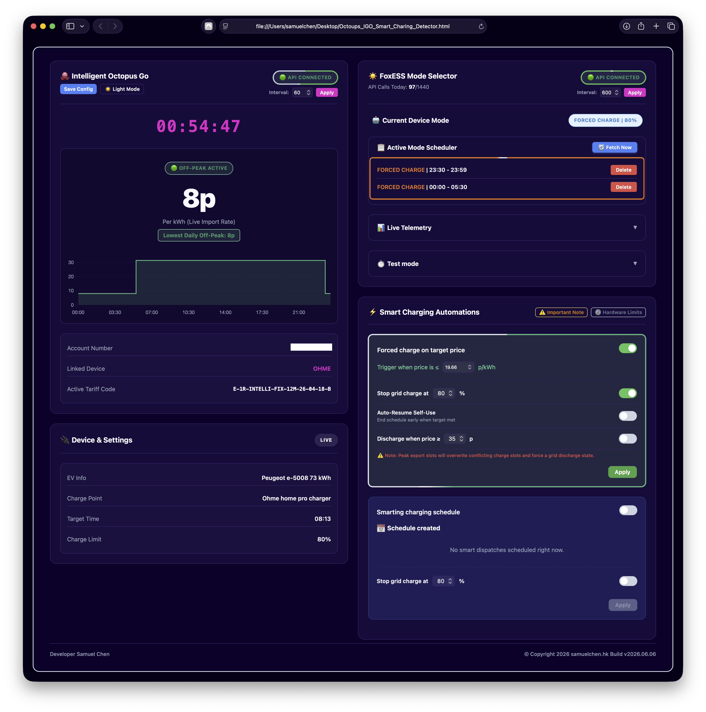

# 🐙🦊 Intelligent Octopus Go & FoxESS Smart Charging Detector

[](https://www.gnu.org/licenses/gpl-3.0)
[](https://samuelkcc.github.io/octopus-foxess-smart-charging/)
[]()

A lightweight, client-side automation bridge that prevents your FoxESS home battery from draining during Intelligent Octopus Go EV charging slots. 

### 🚀 [Launch the Live App Here](https://samuelkcc.github.io/octopus-foxess-smart-charging/)



---

## ✨ Key Features
* **Zero Installation:** Runs entirely inside your browser via GitHub Pages.
* **Privacy First:** Client-side only. No third-party servers, no telemetry, and local credential encryption.
* **Automated Protection:** Automatically syncs Intelligent Octopus Go smart dispatch intervals with the FoxESS V3 Mode Scheduler.
* **Hardware Safe:** Locks your inverter into "Force Charge" only when needed, preserving battery health and maximizing cheap off-peak rates.

---

## 📖 The Problem & Solution
When **Intelligent Octopus Go** dynamically opens a cheap slot to charge your electric vehicle, your FoxESS solar battery thinks your home is experiencing a massive energy load. If your inverter is left in standard "Self-Use" mode, it will aggressively dump all your stored home battery power straight into your EV. 

This wastes captured solar energy, degrades your battery cells, and misses the opportunity to soak up cheap grid rates. This dashboard pulls your upcoming smart dispatch intervals and acts as a bridge, instructing your FoxESS system to insulate your home battery exactly when the car starts charging.

---

## 🛠️ Getting Started 

Follow these steps in order to get your dashboard up and running. 

### Step 1: Gather Your API Credentials
You need API keys from both providers before starting the app.

**Intelligent Octopus Go:**
1. Log into your standard [Octopus Energy dashboard](https://octopus.energy/dashboard/). Find your **Account Number** at the top (`A-XXXXXXXX`).
2. Go to **Personal Details** ➔ **API Access** (or [click here](https://octopus.energy/dashboard/new/accounts/personal-details/api-access)). Generate your **API Key** (`sk_live_...`).

**FoxESS Cloud:**
1. Find your **Inverter Serial Number (SN)** on the physical unit sticker or right beneath the inverter image in your FoxCloud Mobile App (`60B...`).
2. Log into the [FoxCloud Web Dashboard V1](https://www.foxesscloud.com/login). 
   > ⚠️ **Important:** The API token *cannot* be obtained from the V2 website or the mobile app. If you log in and are redirected to the V2 website, click your user profile, scroll to the bottom, and switch back to V1 (or use the V1 direct link above).
3. Navigate to **User Profile** ➔ **API Management** to generate and copy your **API Token**.

### Step 2: Deploy the Proxy Bridge (Google Apps Script)
Because FoxESS blocks direct browser connections, we use a free Google Apps Script to securely route your requests.

#### A. Create the Script
1. Go to [script.google.com](https://script.google.com/) and sign in with your Google account.
2. Click **New Project** (top left).
3. Delete any placeholder code in the editor and paste the exact snippet below:

```javascript
function doPost(e) {
  try {
    var requestData = JSON.parse(e.postData.contents);
    var options = {
      'method': 'post',
      'contentType': 'application/json',
      'headers': requestData.headers,
      'payload': JSON.stringify(requestData.body),
      'muteHttpExceptions': true
    };
    var response = UrlFetchApp.fetch(requestData.url, options);
    return ContentService.createTextOutput(response.getContentText())
                                 .setMimeType(ContentService.MimeType.JSON);
  } catch (err) {
    return ContentService.createTextOutput(JSON.stringify({ errno: 999, msg: err.toString() }))
                                 .setMimeType(ContentService.MimeType.JSON);
  }
}
```

#### B. Deploy as a Web App
1. Click the blue **Deploy** button in the top right corner, then select **New deployment**.
2. Click the **Gear icon** next to "Select type" and choose **Web app**.
3. Set **Execute as** to **Me**.
4. Set **Who has access** to **Anyone** *(This is crucial for the connection to work)*.
5. Click **Deploy** and copy the generated **Web app URL** to your clipboard.

### Step 3: Open the Dashboard
Navigate to the live application: **[Intelligent Octopus Go & FoxESS Smart Charging Detector](https://samuelkcc.github.io/octopus-foxess-smart-charging/)**

*(If you prefer to run it locally rather than hosting it on GitHub Pages, you can download `index.html` from this repository and double-click it to open it natively in your browser. Please note that an active internet connection is still required to communicate with the APIs).*

### Step 4: Launch the App
Paste your Octopus credentials, FoxESS credentials, and your new Google Apps Script Web App URL directly into the dashboard configuration fields and click **Connect**. 

> ⚠️ **CRITICAL: Single Device Operation**
> **Do not run this dashboard on multiple devices simultaneously.** The FoxESS API enforces strict connection limits. Having the app actively running on more than one device at the same time will cause API communication errors, trigger rate-limiting, and ultimately break the automated mode selection updates for your battery.

> 💡 **Pro-Tip: Always-On Dashboard Setup**
> A popular use case is to open the app on a single dedicated device, such as a wall-mounted Android tablet, whenever you plug your EV in. If you do this, **ensure you disable your device's screen timeout/auto-lock**. The browser tab must remain active to continuously monitor and sync the charging slots.

---

## 🔒 Security, Privacy & Data Management
Your security is maintained by design:
* **Zero Third-Party Logging:** This application is a static page. All logic and network requests occur strictly between your browser, your private Google script, and the energy APIs.
* **Local AES-256 Encryption:** Once successfully connected, you can save your configuration directly within your browser. You will be prompted to create a custom password, which locally encrypts your API keys and URLs so you don't have to re-enter them every time you load the dashboard.
* **Wipe Data Feature:** If you are using a shared device or simply want to clean up, you can use the built-in "Wipe Data" button. This will instantly and permanently erase all saved credentials, API keys, and Web App URLs from your browser's local storage.
* **Manual Backups:** For safe manual backups, you can download a locally encrypted backup data file.

---

## ⚖️ Legal Disclaimer
This software is an unofficial, community-driven utility. It is entirely independent and has no official affiliation, endorsement, or operational relationship with Octopus Energy Ltd or FoxESS Co., Ltd. Product names, trademarks, and branding belong exclusively to their respective corporate holders. 

Controlling physical battery infrastructure and working with third-party web services introduces natural hardware degradation and rate-limiting risks. By executing this script, you accept full individual liability for system stability, unexpected inverter behaviors, or billing discrepancies. Monitor system logs consistently.

---

## ☕ Support the Project

If this bridge has saved you money, kept your house battery healthy, or simply made your home automation setup easier, consider buying me a coffee to support continued features and updates!

[](https://buymeacoffee.com/samuelchen)
