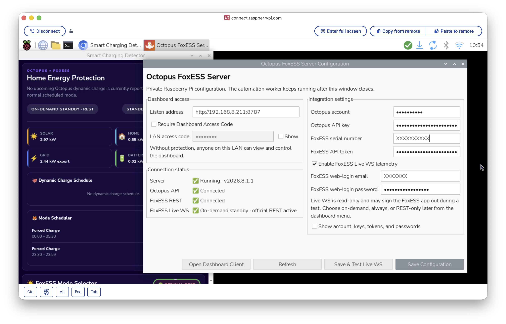
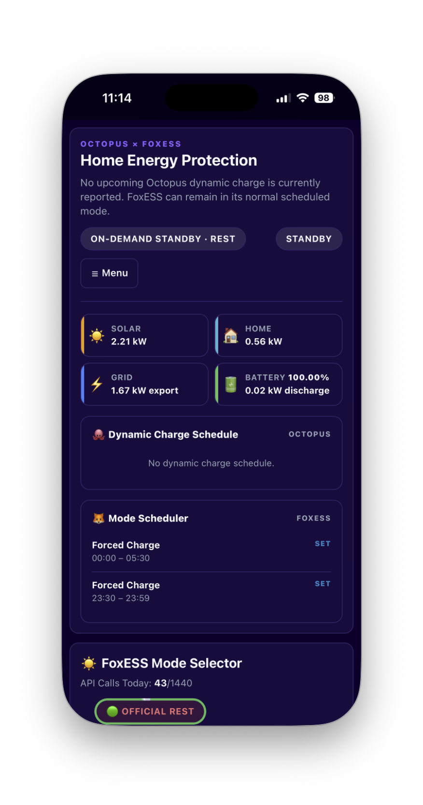

# 🐙🦊 Intelligent Octopus Go & FoxESS Smart Charging Detector

[](https://www.gnu.org/licenses/gpl-3.0)
[](https://samuelkcc.github.io/octopus-foxess-smart-charging/)
[](#raspberry-pi-os-edition)

Protect a FoxESS home battery from discharging into an EV during Intelligent
Octopus Go charging slots. The app follows Octopus dispatches and electricity
prices, then manages the FoxESS schedule automatically.

## Use the web version now

### [▶ Open the live web app](https://samuelkcc.github.io/octopus-foxess-smart-charging/)

The web edition is a standalone single-page application (SPA). No installation
or application server is required. You can either:

- use the hosted version on GitHub Pages; or
- [download the latest standalone HTML file](https://github.com/samuelkcc/octopus-foxess-smart-charging/releases/latest/download/Octopus_IGO_Smart_Charging_Detector.html),
  save it on your computer, and open it in a modern browser.

Both options run the application in your browser. Follow the
[web-edition setup instructions](#web-edition) before connecting your accounts.


## Choose your edition

| | Raspberry Pi OS — recommended | Web app |
|---|---|---|
| Best for | Reliable 24/7 automation | Quick browser use |
| Runs when the browser is closed | Yes | No |
| Phone and tablet access | Yes, over your LAN | Yes |
| FoxESS telemetry | Live WS or official REST | Official REST |
| Google Apps Script | Not required | Required |

- **Raspberry Pi OS:** an always-on server plus a mobile-friendly dashboard for
  phones, tablets, and computers.
- **Web app:** runs directly from GitHub Pages, but the browser must remain open
  and awake for automation to continue.

## What it does

- Protects the home battery during Octopus dynamic EV charging slots.
- Creates separate FoxESS Force Charge and Force Discharge schedules.
- Supports target-price charging, SEG export-price discharging, weekly charging
  and discharging windows, target SOC, power limits, and Auto-Resume.
- Shows import and export prices separately.
- Tracks FoxESS API usage and limits unnecessary requests.
- Provides responsive light, dark, and full-screen layouts, with menu controls
  for showing or hiding the main dashboard blocks.

### Automation precedence and Auto-Resume

**Smart Discharging Automation** is hidden initially. Open **Menu → Dashboard
blocks** to show it. It can discharge when the SEG export price reaches a
threshold or during selected weekly time windows.

To prevent conflicting FoxESS modes, the default precedence is:

1. An active **Smart Dispatch** remains protected; Smart Discharging pauses.
2. Outside a Smart Dispatch, an active discharge rule replaces an overlapping
   target-price or weekly Forced Charge rule.
3. If **Disable Forced Charge while active** is turned off, Forced Charge wins
   instead. If **Pause during Smart Dispatch** is turned off, discharging may
   also replace a Smart Dispatch.

**Auto-Resume Self-Use** only ends the target-price or weekly Forced Charge rule
that reached its target SOC. It never cancels an active Smart Dispatch. When a
Smart Dispatch simply finishes, its schedule ends and FoxESS naturally returns
to the base Self-Use mode unless another configured rule is active, so the app
does not need to create a separate Self-Use schedule.

FoxESS accepts at most five active scheduler periods. The app merges adjacent
compatible periods and warns if later periods cannot fit within that limit.

## What you need

- Your Octopus account number (`A-...`) and API key (`sk_live_...`) from
  [Octopus API Access](https://octopus.energy/dashboard/new/accounts/personal-details/api-access).
- Your FoxESS inverter serial number and API token from the
  [FoxESSCloud V1 website](https://www.foxesscloud.com/login), as described
  below.
- For optional Live WS telemetry, your FoxCloud web login details.

### Get your FoxESS API token and inverter serial number

Sign in to the [FoxESSCloud V1 website](https://www.foxesscloud.com/login).

To generate the API token:

1. Select the user profile icon in the top-right corner.
2. Select **User Profile**.
3. Select **API Management** in the left-hand panel.
4. Open the **Private Token** tab and select **Generate API key**.
5. Copy the generated key and enter it as the **FoxESS API Token** in this app.

Store the key securely when it is generated. FoxESSCloud will not display the
complete key again, and you should not share it publicly.

To find the inverter serial number:

1. Return to the main FoxESSCloud V1 dashboard.
2. In the left-hand menu, open **Device → Inverter**.
3. Copy the value shown in the **Inverter SN** column and enter it as the
   **FoxESS Inverter Serial Number** in this app.

> FoxESS API tokens are generated on the V1 website, not on the V2 website or
> in the mobile app.

## Raspberry Pi OS edition

Recommended for Raspberry Pi 4 or 5 running a current Raspberry Pi OS.

### 1. Install

Run this command on the Pi:

```bash
curl -fsSL https://raw.githubusercontent.com/samuelkcc/octopus-foxess-smart-charging/main/linux/install.sh | sudo sh
```

The installer creates the always-on services, starts them after reboot, and
adds **Octopus FoxESS Server** and **Octopus FoxESS Dashboard** to the desktop.

### 2. Configure

Open the taskbar icon and select **Server Configuration…**. Enter your Octopus
and FoxESS details. To make Live WS available, enable **FoxESS Live WS
telemetry**, enter the revealed FoxESS web-login details, then save and run the
connection check.

The taskbar icon shows the server state:

- **Green:** connected and healthy
- **Amber:** waiting or using a safe fallback
- **Red:** configuration or connection needs attention



### 3. Open the dashboard

On any device connected to the same network, open the address shown in **Server
Configuration**, for example:

```text
http://192.168.1.42:8787
```

Enter the Dashboard Access Code when prompted. Your device remembers a valid
code until you select **Menu → Remove Access Code**.

For app-style access:

- **iPhone/iPad:** open the page in Safari, then tap **Share → Add to Home
  Screen**.
- **Android:** open the browser menu, then select **Add to Home screen** or
  **Install app**.

<p align="center">
  
</p>

If the Pi address changes, try `http://raspberrypi.local:8787` or run
`hostname -I` on the Pi.

### FoxESS telemetry

First enable Live WS and save its web-login credentials in native **Server
Configuration**. Then choose the operating mode from **Menu → FoxESS
telemetry** in any Pi dashboard client:

| Mode | Behaviour |
|---|---|
| **Live WS on demand (default)** | Uses REST normally and Live WS only during an active Octopus dynamic charge. |
| **Always Live WebSocket (REST fallback)** | Keeps live telemetry connected and falls back to REST automatically. |
| **Official REST API only** | Disables Live WS and uses only the FoxESS Open API. |

Live WS is read-only. Every scheduler or inverter change still uses the
official FoxESS REST API. The live interface is undocumented and may change;
if it is unavailable, the Pi safely returns to REST.

**Save & Test Live WS** is optional and may sign the FoxESS mobile app out.
Opening Server Configuration by itself does not log in to FoxCloud.

### Access away from home

A private VPN is the safest option. DDNS and port forwarding can also be used,
but only through an authenticated **HTTPS reverse proxy** with Dashboard Access
Code protection enabled.

**Never expose the Pi's raw HTTP port `8787` directly to the internet.**

### Update or remove

Select **Update Raspberry Pi Edition** in Server Configuration. Approve the
Raspberry Pi OS administrator prompt; the latest release is installed and the
services restart automatically. Your encrypted configuration and access code
are preserved.

> Existing installations without the update button need the install command
> one final time. Future releases can then be installed from Server
> Configuration without typing a terminal command.

<details>
<summary><strong>Service status and troubleshooting commands</strong></summary>

```bash
sudo systemctl status octopus-foxess octopus-foxess-worker octopus-foxess-inhibit
sudo journalctl -u octopus-foxess -u octopus-foxess-worker -u octopus-foxess-inhibit -f
sudo systemctl restart octopus-foxess octopus-foxess-worker octopus-foxess-inhibit
```

</details>

To completely uninstall the Pi edition:

```bash
curl -fsSL https://raw.githubusercontent.com/samuelkcc/octopus-foxess-smart-charging/main/linux/uninstall.sh | sudo sh
```

> Uninstalling removes the services, application, access code, and encrypted
> configuration.

## Web edition

[Open the live web app](https://samuelkcc.github.io/octopus-foxess-smart-charging/).

The web edition needs a personal Google Apps Script relay because a static web
page cannot contact FoxESS Cloud directly. Keep the dashboard open and the
device awake while automation is active.

### Create the FoxESS relay

1. Create a project at [Google Apps Script](https://script.google.com/).
2. Add the relay code below.
3. Select **Deploy → New deployment → Web app**.
4. Set **Execute as** to **Me** and **Who has access** to **Anyone**.
5. Deploy, then paste the Web App URL into the dashboard login screen.

<details>
<summary><strong>Show Google Apps Script relay code</strong></summary>

```javascript
function doPost(e) {
  try {
    var requestData = JSON.parse(e.postData.contents);
    var options = {
      method: 'post',
      contentType: 'application/json',
      headers: requestData.headers,
      payload: JSON.stringify(requestData.body),
      muteHttpExceptions: true
    };
    var response = UrlFetchApp.fetch(requestData.url, options);
    return ContentService.createTextOutput(response.getContentText())
      .setMimeType(ContentService.MimeType.JSON);
  } catch (err) {
    return ContentService.createTextOutput(JSON.stringify({
      errno: 999,
      msg: err.toString()
    })).setMimeType(ContentService.MimeType.JSON);
  }
}
```

</details>

Use only one active automation dashboard. For unattended operation, use the
Raspberry Pi edition.

## Security and privacy

### Web SPA

The web edition is a static, client-side SPA. It can run from
[GitHub Pages](https://samuelkcc.github.io/octopus-foxess-smart-charging/) or as
the [downloaded standalone HTML file](https://github.com/samuelkcc/octopus-foxess-smart-charging/releases/latest/download/Octopus_IGO_Smart_Charging_Detector.html)
on your own computer. There is no developer-operated application server and no
analytics or tracking code.

- Your account numbers, API credentials, relay URL, and preferences are stored
  only in that browser profile. They are not uploaded to this repository or
  stored by GitHub Pages.
- Persisted credentials are encrypted in the browser with AES-GCM. The
  non-exportable encryption key is kept in IndexedDB and the encrypted record
  is kept in local storage. If secure persistent storage is unavailable, the
  app falls back to session-only storage.
- Credentials still have to be used for authenticated requests: Octopus
  credentials are sent directly to the Octopus Energy API, while signed FoxESS
  requests pass through the Google Apps Script relay that you create and then
  go to FoxESS Cloud.
- To remove all saved web-app data, open **Menu → Wipe Local Data** and confirm
  **Yes, Wipe Data**. This clears the app's local storage, session storage, and
  IndexedDB data from the current browser profile.
- Browser storage is separate for each browser, profile, and site location. If
  you have used both GitHub Pages and a downloaded copy, wipe each copy
  separately. Clearing the browser's site data also removes the saved data.
- **Save Config** is optional. If you use it, the app creates a
  passphrase-encrypted backup file that you control. **Wipe Local Data** cannot
  delete copies of that exported file, so remove them separately when they are
  no longer needed.
- Avoid using the app on a shared or public computer, keep the device and
  browser profile protected, and remember that web-edition automation stops
  when the page is closed or the device sleeps.

### Raspberry Pi edition

- Credentials and automation settings are encrypted on the Pi and are never
  returned to browser clients on the LAN.
- The Pi performs Octopus authentication and signs FoxESS requests for the
  dashboard. The browser client only receives the data needed to display and
  control the app.
- Live WS carries read-only telemetry; all scheduler and inverter controls use
  the official FoxESS REST API.
- Keep Dashboard Access Code protection enabled. Use a private VPN for remote
  access, or an authenticated HTTPS reverse proxy if a VPN is not available.
  Never expose the Pi's raw HTTP port directly to the internet.

## Build from source

Node.js 18 or newer is required.

```bash
npm install
npm run check
```

Build output is written to `dist/`. Pushes to `main` deploy the web edition;
tags beginning with `v` create GitHub release assets for both editions.

## Acknowledgements

The optional FoxESS Live WS module is adapted from Nick Farrell's
[`nicois/foxess-control`](https://github.com/nicois/foxess-control) project
under the MIT License. See [`THIRD_PARTY_NOTICES.md`](THIRD_PARTY_NOTICES.md)
for licence and component details.

## Disclaimer

This unofficial community project is independent of Octopus Energy Ltd and
FoxESS Co., Ltd. You are responsible for checking schedules, limits, billing,
and inverter behaviour before relying on automatic controls.

## Support the project ☕

If this project saves you time or helps protect your home battery, you can
support future maintenance and improvements:

[](https://buymeacoffee.com/samuelchen)
