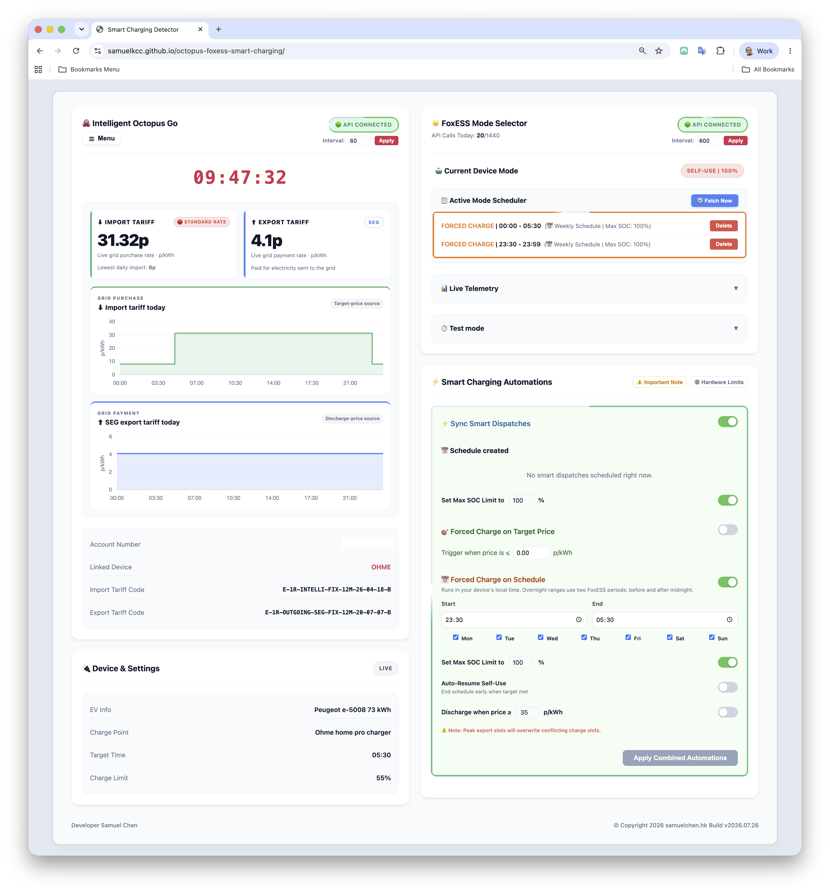

# 🐙🦊 Intelligent Octopus Go & FoxESS Smart Charging Detector

[](https://www.gnu.org/licenses/gpl-3.0)
[](https://samuelkcc.github.io/octopus-foxess-smart-charging/)
[](#raspberry-pi-os-edition)

Protect a FoxESS home battery from discharging into an EV during Intelligent
Octopus Go charging slots. The app follows Octopus dispatches and electricity
prices, then manages the FoxESS schedule automatically.

## Use the web version now

### [▶ Open the live web app](https://samuelkcc.github.io/octopus-foxess-smart-charging/)

No installation is required. Open it in a modern browser and follow the
[web-edition setup instructions](#web-edition).



## Choose your edition

| | Raspberry Pi OS — recommended | Web app |
|---|---|---|
| Best for | Reliable 24/7 automation | Quick browser use |
| Runs when the browser is closed | Yes | No |
| Phone and tablet access | Yes, over your LAN | Yes |
| FoxESS telemetry | Live WS or official REST | Official REST |
| Google Apps Script | Not required | Required |

- **Raspberry Pi OS:** an always-on server plus a mobile-friendly dashboard for
  phones, tablets, and computers.
- **Web app:** runs directly from GitHub Pages, but the browser must remain open
  and awake for automation to continue.

## What it does

- Protects the home battery during Octopus dynamic EV charging slots.
- Creates FoxESS Force Charge and battery-protection schedules.
- Supports target-price charging, SEG export rates, weekly time windows, target
  SOC, power limits, and Auto-Resume.
- Shows import and export prices separately.
- Tracks FoxESS API usage and limits unnecessary requests.
- Provides responsive light, dark, full-screen, and Mini HUD layouts.

## What you need

- Your Octopus account number (`A-...`) and API key (`sk_live_...`) from
  [Octopus API Access](https://octopus.energy/dashboard/new/accounts/personal-details/api-access).
- Your FoxESS inverter serial number and API token from **User Profile → API
  Management** on the [FoxCloud V1 website](https://www.foxesscloud.com/login).
- For optional Live WS telemetry, your FoxCloud web login details.

> FoxESS API tokens are created on the V1 website, not in the V2 website or
> mobile app.

## Raspberry Pi OS edition

Recommended for Raspberry Pi 4 or 5 running a current Raspberry Pi OS.

### 1. Install

Run this command on the Pi:

```bash
curl -fsSL https://raw.githubusercontent.com/samuelkcc/octopus-foxess-smart-charging/main/linux/install.sh | sudo sh
```

The installer creates the always-on services, starts them after reboot, and
adds **Octopus FoxESS Server** and **Octopus FoxESS Dashboard** to the desktop.

### 2. Configure

Open the taskbar icon and select **Server Configuration…**. Enter your Octopus
and FoxESS details. To make Live WS available, enable **FoxESS Live WS
telemetry**, enter the revealed FoxESS web-login details, then save and run the
connection check.

The taskbar icon shows the server state:

- **Green:** connected and healthy
- **Amber:** waiting or using a safe fallback
- **Red:** configuration or connection needs attention

### 3. Open the dashboard

On any device connected to the same network, open the address shown in **Server
Configuration**, for example:

```text
http://192.168.1.42:8787
```

Enter the Dashboard Access Code when prompted. Your device remembers a valid
code until you select **Menu → Remove Access Code**.

For app-style access:

- **iPhone/iPad:** open the page in Safari, then tap **Share → Add to Home
  Screen**.
- **Android:** open the browser menu, then select **Add to Home screen** or
  **Install app**.

If the Pi address changes, try `http://raspberrypi.local:8787` or run
`hostname -I` on the Pi.

### FoxESS telemetry

First enable Live WS and save its web-login credentials in native **Server
Configuration**. Then choose the operating mode from **Menu → FoxESS
telemetry** in any Pi dashboard client:

| Mode | Behaviour |
|---|---|
| **Live WS on demand (default)** | Uses REST normally and Live WS only during an active Octopus dynamic charge. |
| **Always Live WebSocket (REST fallback)** | Keeps live telemetry connected and falls back to REST automatically. |
| **Official REST API only** | Disables Live WS and uses only the FoxESS Open API. |

Live WS is read-only. Every scheduler or inverter change still uses the
official FoxESS REST API. The live interface is undocumented and may change;
if it is unavailable, the Pi safely returns to REST.

**Save & Test Live WS** is optional and may sign the FoxESS mobile app out.
Opening Server Configuration by itself does not log in to FoxCloud.

### Access away from home

A private VPN is the safest option. DDNS and port forwarding can also be used,
but only through an authenticated **HTTPS reverse proxy** with Dashboard Access
Code protection enabled.

**Never expose the Pi's raw HTTP port `8787` directly to the internet.**

### Update or remove

Run the install command again to update. Your encrypted configuration and
access code are preserved.

<details>
<summary><strong>Service status and troubleshooting commands</strong></summary>

```bash
sudo systemctl status octopus-foxess octopus-foxess-worker octopus-foxess-inhibit
sudo journalctl -u octopus-foxess -u octopus-foxess-worker -u octopus-foxess-inhibit -f
sudo systemctl restart octopus-foxess octopus-foxess-worker octopus-foxess-inhibit
```

</details>

To completely uninstall the Pi edition:

```bash
curl -fsSL https://raw.githubusercontent.com/samuelkcc/octopus-foxess-smart-charging/main/linux/uninstall.sh | sudo sh
```

> Uninstalling removes the services, application, access code, and encrypted
> configuration.

## Web edition

[Open the live web app](https://samuelkcc.github.io/octopus-foxess-smart-charging/).

The web edition needs a personal Google Apps Script relay because a static web
page cannot contact FoxESS Cloud directly. Keep the dashboard open and the
device awake while automation is active.

### Create the FoxESS relay

1. Create a project at [Google Apps Script](https://script.google.com/).
2. Add the relay code below.
3. Select **Deploy → New deployment → Web app**.
4. Set **Execute as** to **Me** and **Who has access** to **Anyone**.
5. Deploy, then paste the Web App URL into the dashboard login screen.

<details>
<summary><strong>Show Google Apps Script relay code</strong></summary>

```javascript
function doPost(e) {
  try {
    var requestData = JSON.parse(e.postData.contents);
    var options = {
      method: 'post',
      contentType: 'application/json',
      headers: requestData.headers,
      payload: JSON.stringify(requestData.body),
      muteHttpExceptions: true
    };
    var response = UrlFetchApp.fetch(requestData.url, options);
    return ContentService.createTextOutput(response.getContentText())
      .setMimeType(ContentService.MimeType.JSON);
  } catch (err) {
    return ContentService.createTextOutput(JSON.stringify({
      errno: 999,
      msg: err.toString()
    })).setMimeType(ContentService.MimeType.JSON);
  }
}
```

</details>

Use only one active automation dashboard. For unattended operation, use the
Raspberry Pi edition.

## Security

- This project has no tracking or third-party application server.
- Raspberry Pi credentials are encrypted and never sent to LAN clients.
- The Pi performs Octopus authentication and signs FoxESS requests for the
  dashboard.
- Live WS carries read-only telemetry; all controls use the official REST API.
- Keep Dashboard Access Code protection enabled and use VPN or HTTPS for remote
  access.

## Build from source

Node.js 18 or newer is required.

```bash
npm install
npm run check
```

Build output is written to `dist/`. Pushes to `main` deploy the web edition;
tags beginning with `v` create GitHub release assets for both editions.

## Acknowledgements

The optional FoxESS Live WS module is adapted from Nick Farrell's
[`nicois/foxess-control`](https://github.com/nicois/foxess-control) project
under the MIT License. See [`THIRD_PARTY_NOTICES.md`](THIRD_PARTY_NOTICES.md)
for licence and component details.

## Disclaimer

This unofficial community project is independent of Octopus Energy Ltd and
FoxESS Co., Ltd. You are responsible for checking schedules, limits, billing,
and inverter behaviour before relying on automatic controls.

## Support the project

If this project helps you, you can
[buy Samuel a coffee](https://buymeacoffee.com/samuelchen).
